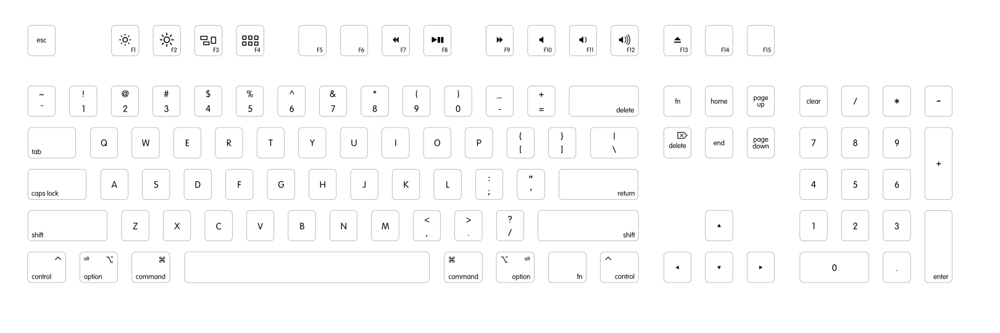
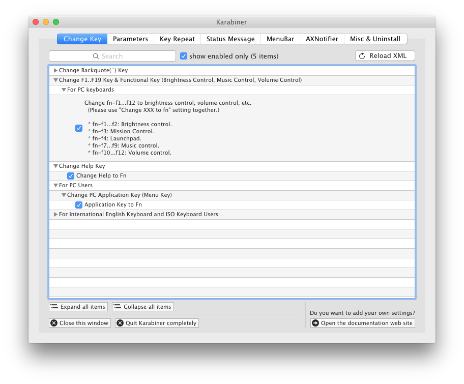
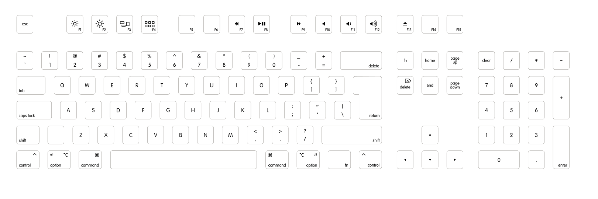
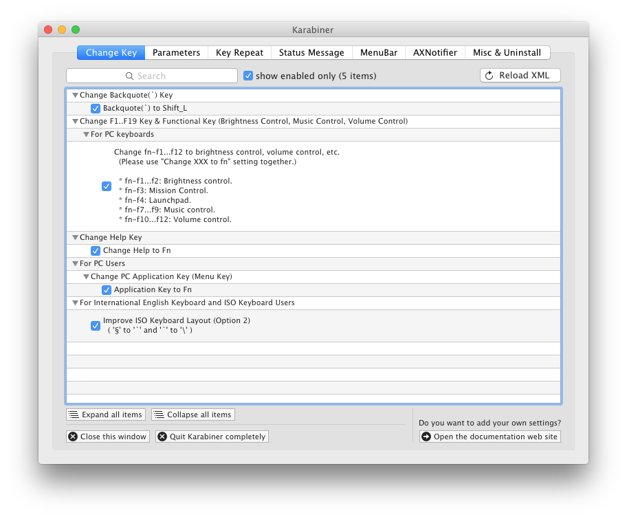

Apple Keyboard Layout for WASD V2 Keyboards
===========================================

Custom Mac ANSI-104 and ISO-105 keyboard layouts that aim to reproduce the modern Apple Keyboard layout suitable for use with a WASD V2 keyboard or similar.

Layouts
=======

ANSI
----

ISO
---

Features
========

Based on the Mac layout provided by WASD Keyboards, this layout contains the following changes:

* Iconography, such as media keys, brightness and expose/dashboard on the 
  function key row.
* Function key text is capitalized and bottom-right aligned.
* Icons for option (⌥) and control (⌃), complimenting command (⌘).
* Fn key in place of insert.
* Enter key text is right-aligned.

Updates for 2015 templates

* F3 (Mission Control) and F4 (Launchpad) icons updated
* delete icon added to keypad delete key

Details
=======

* The font is VAG Rounded Light.
* The media player icons are from the Font Awesome set.
* The media volume icons use the Font Awesome speaker cone combined with
  the more accurate emanating lines from the originals in the WASD V2 template.
* The option and control icons are customized to match the rest of the font
  aesthetic.
* Pg Up/Pg Down have been expanded to Page Up/Page Down.
* Mission Control, Launchpad and delete icons from WASD artwork.

Font on most keys is VAG Rounded Light 11. Functions keys are size 10.
Multi-line keys (page up/down) are centered with line spacing 0.97.

Activate layer "Alpha - US QWERTY Mac" to see the layout.

Outstanding Issues
==================

* The key between right command and control doesn't exist on Apple keyboards.
  This is currently a second fn; maybe it should be something else? If used as fn,
  it can be physically swapped with the control key, as they are the same size on
  the WASD keyboard. (both dimension R1 1x1.25)
* The eject key shares F13. Should this become its own key, reducing the number
  of F-keys by one to F14?

Included Files
==============

* `custom-mac-layout-104.svg` and `custom-mac-layout-105.svg` The custom layouts.
* `custom-mac-layout-104-karabiner.svg` and `custom-mac-layout-105-karabiner.svg` The keysettings to make the keys work.
* `wasd-inkscape-*-2015.svg` The WASD-provided keyboard templates.
* `wasd-keysizes.png` Key sizes used on WASD V2 104 key.

Resources
=========

* [Font Awesome](http://fortawesome.github.io/Font-Awesome/)
* [WASD Keyboards](http://www.wasdkeyboards.com)
* [Karabiner](https://pqrs.org/osx/karabiner/)
